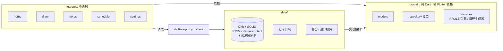

---
AIGC:
  ContentProducer: '001191110102MAD55U9H0F10002'
  ContentPropagator: '001191110102MAD55U9H0F10002'
  Label: '1'
  ProduceID: 'b7d5871e-2519-4d5c-b91e-b91d0d03acf6'
  PropagateID: 'b7d5871e-2519-4d5c-b91e-b91d0d03acf6'
  ReservedCode1: 'ad22bdc6-e7b2-49cc-96a6-4a69309783de'
  ReservedCode2: 'ad22bdc6-e7b2-49cc-96a6-4a69309783de'
---

<div align="center">

# 小满 · xiaoman-app

**本地优先的日记 · 备忘 · 日程 Android 应用**

_满而未满，刚刚好。_

[](https://flutter.dev)
[](https://dart.dev)
[](https://android.com)
[](#构建)
[](LICENSE)
[](https://github.com/3fa2/xiaoman-app/pulls)

**纯本地存储 · 零网络请求 · 零账号体系** —— 数据只在你自己的手机上。

</div>

---

## 为什么是小满

市面上的日记/备忘应用要么把数据存在别人的云上，要么塞满你不需要的功能。
小满反着来：**数据库在你手机里，退出即走，没有广告、没有注册、没有追踪**。
它由「三位一体 v4」全量重构而来，是一个自用需求驱动的开源作品。

## 功能总览

### :black_nib: 日记

| | |
|---|---|
| :heart: **心情打卡** | 8 个预设心情 + 自定义心情（名字 + 12 色任选），支持补记昨天 |
| :books: **多日记本** | 自建分类（碎碎念/认知日记/…），16 色标识，按本筛选 |
| :mag: **全文搜索** | SQLite FTS5 外部内容索引，中文 unicode61 分词，短词自动回退 LIKE |
| :calendar: **日历视图** | 有日记的日期显示心情色点，心情趋势折线图 |
| :camera: **媒体附加** | 照片 / 视频 / 实况照片（Live Photo），全屏预览 + 缩放 |
| :pencil: **自动保存** | 2s 去抖 + 生命周期兜底 + 崩溃恢复草稿，三道防线不丢字 |

### :clipboard: 备忘

| | |
|---|---|
| :bookmark_tabs: **Markdown** | 正文支持 Markdown 渲染 |
| :white_check_mark: **待办清单** | 笔记内子项打勾，回车即加 |
| :pushpin: **置顶 + 标签** | 16 色笔记本分类，标签 csv 存储 |
| :mag: **全文搜索** | 与日记同一套 FTS5 索引 |

### :date: 日程

| | |
|---|---|
| :arrows_counterclockwise: **模板 + 实例分离** | 重复规则改一次，未来实例自动重建；手动改过的块自动分离（detach）不再受影响 |
| :repeat: **9 种重复规则** | 不重复（单天）/ **连续几天（时间段，如中秋 25–27）** / 每天 / 每隔 N 天 / 每周（选周几）/ 每月第 N 个周几 / 每月某日 / 每年 |
| :bell: **精确闹钟提醒** | 提前量可配（5/15/30 分钟/1 天），重启自动重建全部闹钟 |
| :battery: **国产 ROM 兜底** | 自启动指引 + 三重提醒兜底，对抗激进省电 |
| :no_entry_sign: **skip 可撤销** | 跳过某天走 EXDATE 语义，不是物理删除 |

### :lock: 通用

- JSON 备份导出 / 导入（覆盖恢复 + FTS 索引重建 + 统计回执）
- 密码锁 + 生物识别（指纹/面容）
- 浅色 / 深色主题，Material 3 动效（fadeThrough / sharedAxis / openContainer）
- Android 自适应图标 + Android 13+ 主题化图标

## 架构



**三条设计铁律**（`tool/check_architecture.dart` 强制守护，0 违规）：

1. 骨架无彩色——导航/按钮/卡片一律中性灰阶，颜色只出现在心情/笔记本/日程等内容组件里
2. domain 层纯净——不 import Flutter，生成器/RRULE 引擎可独立单测
3. 单文件 ≤ 300 行，依赖方向只允许 `features → domain ← data`

<details>
<summary><b>:wrench: 更多工程细节</b></summary>

- **FTS5 外部内容模式**：正文存主表，FTS 只存索引，AFTER INSERT/DELETE/UPDATE 触发器同步；备份导入后 `rebuild` 重建全量索引
- **滚动窗口生成**：日程模板只物化未来 14 天实例，每天滚动补生成；模板起始日回看 30 天防漏
- **skip-on-conflict**：模板生成实例时若与手工块时间重叠则跳过，绝不覆盖用户手排的日程
- **WAL checkpoint**：导出/备份前强制 `wal_checkpoint(FULL)`，杜绝"备份到的是旧数据"
- **提醒三层可靠**：Dart 侧重排 + 原生精确闹钟持久化 + BootReceiver 六类事件重建
- **迁移有迹可循**：schema 已迭代 5 个版本（标签列 → 多日记本 → 心情色重排 → 起止日期），全部带自动迁移
</details>

## 快速开始

```bash
git clone https://github.com/3fa2/xiaoman-app.git
cd xiaoman-app
flutter pub get
flutter test                          # 58 个测试
flutter build apk --release           # 产物 build/app/outputs/flutter-apk/
```

不需要任何 API key、签名文件或云服务，克隆即构建。

<details>
<summary><b>:file_folder: 项目结构</b></summary>

```
lib/
├── app/            # AppShell、路由表
├── design/         # 设计令牌（色板/间距/字号/动效，唯一真源）
├── di/             # Riverpod providers
├── domain/         # 纯 Dart：模型 + 仓库接口 + 服务（生成器/RRULE）
├── data/           # Drift 表 + 仓库实现 + 备份/通知服务
└── features/
    ├── home/       # 首页（今日日程 + 7 天心情 + 快速入口）
    ├── diary/      # 日记（编辑器/日历/趋势/搜索）
    ├── notes/      # 备忘（编辑器/笔记本/搜索）
    ├── schedule/   # 日程（时间轴/模板管理/编辑）
    ├── settings/   # 设置（主题/锁屏/备份/提醒诊断）
    └── shared/     # 通用组件（骨架屏/确认弹窗/空态）
```

</details>

<!-- 截图位：建议放 3-4 张首页/日记/日程图到 docs/screenshots/ 后取消注释
<p align="center">
  
  
  
</p>
-->

## 隐私声明

- `INTERNET` 权限仅供调试期构建工具使用，**运行期零网络请求**（可抓包验证）
- 所有数据存于应用私有目录，不上传任何服务器，卸载即清除
- 备份文件由你自行导出保存，导入即覆盖恢复

## 参与贡献

欢迎 Issue 讨论 bug 与想法；PR 请保持两条纪律：domain 层不碰 Flutter、单文件 ≤ 300 行。

## License

[MIT](LICENSE) © 2026
